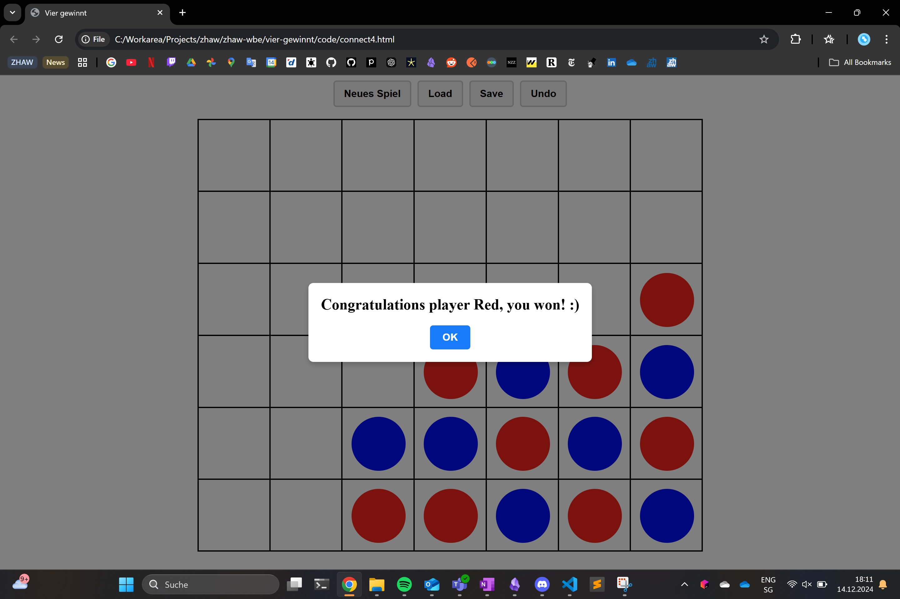

##  Vier Gewinnt – Ein Webentwicklungsprojekt

Micha Mettler, mettlmi1@students.zhaw.ch

Dies ist ein Vier-Gewinnt Miniprojekt, das im Rahmen des "Webentwicklung"-Kurses an der Zürcher Hochschule für Angewandte Wissenschaften (ZHAW) unter Beaufsichtigung von Dr. Gerrit Burkert durchgeführt wurde.

### Funktionsumfang
Der folgende Funktionsumfang ist enthalten:
- Möglichkeit zum Persistieren des Spielzustands (über `localStorage`)
- Mehrfaches Undo
- Erkennen, wenn ein Spieler gewonnen hat
- Spielfeld löschen

### Technische Anmerkung
Die Frontend-Bibliothek SuiWeb (https://github.com/suiweb/suiweb?tab=readme-ov-file) wurde nicht eingebunden, da die Umstellung auf `type="module"` zu CORS-Fehlern führte.  Um das Projekt problemlos auf GitHub Pages bereitstellen zu können, wurde somit darauf verzichtet.

### Screenshots
Im Folgenden sind Screenshots enthalten, welche die Benutzeroberfläche und die wichtigsten Funktionen des Projekts zeigen:

#### Spielstart

#### Während des Spiels

#### Spielende
